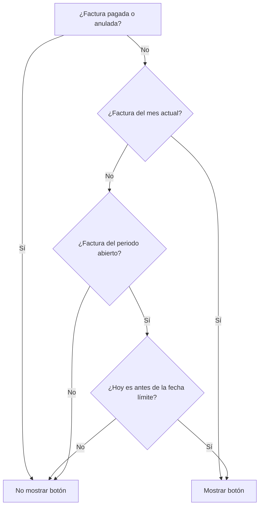

# Lógica de visualización del botón "Anular" en Consulta de Facturas SIAT

## Objetivo
Controlar de manera precisa y transparente cuándo se permite anular una factura desde el frontend, de acuerdo a las reglas de negocio y el periodo de revisión definido por la administración.

---

## Reglas de negocio

1. **Facturas del mes actual (mes en curso):**
   - Siempre pueden ser anuladas (siempre se muestra el botón de anular), salvo que estén pagadas o ya anuladas.

2. **Facturas del periodo abierto (mes anterior al mes actual):**
   - Solo pueden ser anuladas si la fecha actual es **anterior** a la `fecha_limite_anulacion` definida en la base de datos.
   - Ejemplo: Si la fecha límite es `2025-07-07 09:00:00`, el periodo abierto es **junio 2025**. Hasta el 7 de julio a las 9:00, se puede anular facturas de junio.

3. **Facturas de meses anteriores al periodo abierto:**
   - Nunca pueden ser anuladas (nunca se muestra el botón de anular).

4. **Facturas pagadas o ya anuladas:**
   - Nunca pueden ser anuladas (nunca se muestra el botón de anular), sin importar el periodo.

---

## Ejemplo práctico

- **Hoy:** 2 de julio de 2025
- **fecha_limite_anulacion:** `2025-07-07 09:00:00`

| Fecha de la factura | ¿Se muestra botón de anular? | Motivo                                                        |
|---------------------|------------------------------|---------------------------------------------------------------|
| 2025-07-01          | Sí                           | Es del mes actual (julio 2025)                                |
| 2025-06-15          | Sí                           | Es del periodo abierto (junio 2025, antes de la fecha límite) |
| 2025-05-20          | No                           | Es de un mes anterior al periodo abierto                      |
| 2025-06-10 (pagada) | No                           | Está pagada                                                   |
| 2025-07-03 (anulada)| No                           | Ya está anulada                                               |

---

## Consideraciones técnicas

- La fecha límite de anulación se consulta desde la base de datos antes de renderizar la tabla.
- La lógica se aplica en la función que genera los botones de acción en la tabla (`buttons`).
- Se usan funciones auxiliares para comparar el mes/año de la factura con el periodo abierto y la fecha actual.
- El botón de anular solo aparece si todas las condiciones anteriores se cumplen.

---

## ¿Por qué así?
- Permite a los usuarios anular facturas del mes en curso sin restricciones.
- Da un periodo de gracia para anular facturas del mes anterior, pero solo hasta la fecha límite definida por administración.
- Evita errores y anulaciones fuera de plazo, alineando el sistema con la normativa tributaria y los procesos internos.

---

**Última actualización:** Julio 2025 

## Diagrama de flujo de la lógica (Mermaid)

A continuación se muestra un diagrama de flujo usando el lenguaje [Mermaid](https://mermaid-js.github.io/), que es compatible con muchos visores de Markdown (como GitHub, VSCode, Obsidian, etc). Si tu visor soporta Mermaid, verás el diagrama renderizado automáticamente.

> **Nota para principiantes:**
> - Este diagrama representa la lógica de decisión para mostrar el botón de anular.
> - Mermaid es un lenguaje de marcado para diagramas, muy útil para documentar procesos lógicos en Markdown.
> - Si necesitas exportar el diagrama como imagen, puedes usar herramientas online como [Mermaid Live Editor](https://mermaid-js.github.io/mermaid-live-editor/) para pegar el código y descargarlo como PNG o SVG. 